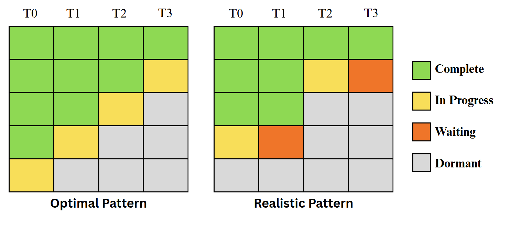

## HP1 - Honors Project (DNA LCS Computation)
### Rykir Evans
### Description:

This project examines two multithreaded solutions to computing the Longest Common Subsequence (LCS) of two randomized DNA sequences. This algorithm heavily depends on previously computed values, which inherently contradicts the nature of multithreading. However, both solutions drastically improved the time to compute the LCS of 2 sequences that are 10,000 characters in length thanks to creative timing blocks. By requirement, both solutions utilize 4 threads where each thread processes a section of the LCS array that is 100 rows and 2,500 columns. This layout naturally leads to dividing the table into 4 column section, and simply assigning one thread to one column section. However, since computing any given array cell requires its west, north, and northwest neighbors be present, each column section must wait until it can be sure those are present at the boundaries. To accomplish this, generally, Thread 0 runs without bound, Thread 1 waits on the Thread 0 section to finish before starting, Thread 2 waits on Thread 1 and so on. The figure below showcases both an optimal and realistic scenario of how the threads may compute the array sections.

The primary reason this project covers two solutions is due to improvement of an original solution that utilized a mutex semaphore and `pthread` conditionals. It was recommended that the program implement counting semaphores instead, however the original functioned correctly, and thus is included in this project.

### Usage
For WSL, the following instructions may be used to run the program:
1. Navigate to the directory of the program
2. Use the g++ compiler or any standard C++ compiler `g++ fileName.cpp -o executableName`
3. Run the program using `./execuableName`

Either solution will automatically run the algorithm and output the bottom corner of the resulting LCS array as well as it's execution time. If desired, you may navigate to the `Testing_Code` folder and play with the code snippets there. Each one has a description of its purpose.

|  #  | File/Folder                                               | Description                                      |
| --- | --------------------------------------------------------- | ------------------------------------------------ |
|  1  | [mutex.cpp](./mutex.cpp)                                  | Original solution using mutex                    |
|  2  | [semaphore.cpp](./semaphore.cpp)                          | Improved solution using counting semaphores      |
|  3  | [Testing_Code Folder](./Testing_Code/)                    | Folder containing code snippets used for testing |
| 3.1 | [multirun1.cpp](./Testing_Code/multirun1.cpp)             | Mass testing for mutex solution                  |
| 3.2 | [multirun2.cpp](./Testing_Code/multirun2.cpp)             | Mass testing for semaphore solution              |
| 3.3 | [nonthreaded.cpp](./Testing_Code/nonthreaded.cpp)         | Single threaded version for omparison            |
| 3.4 | [troubleshooting.cpp](./Testing_Code/troubleshooting.cpp) | Original development code with console debugging |

> Note: None of the files depend on each other, all showcase different parts of the project

